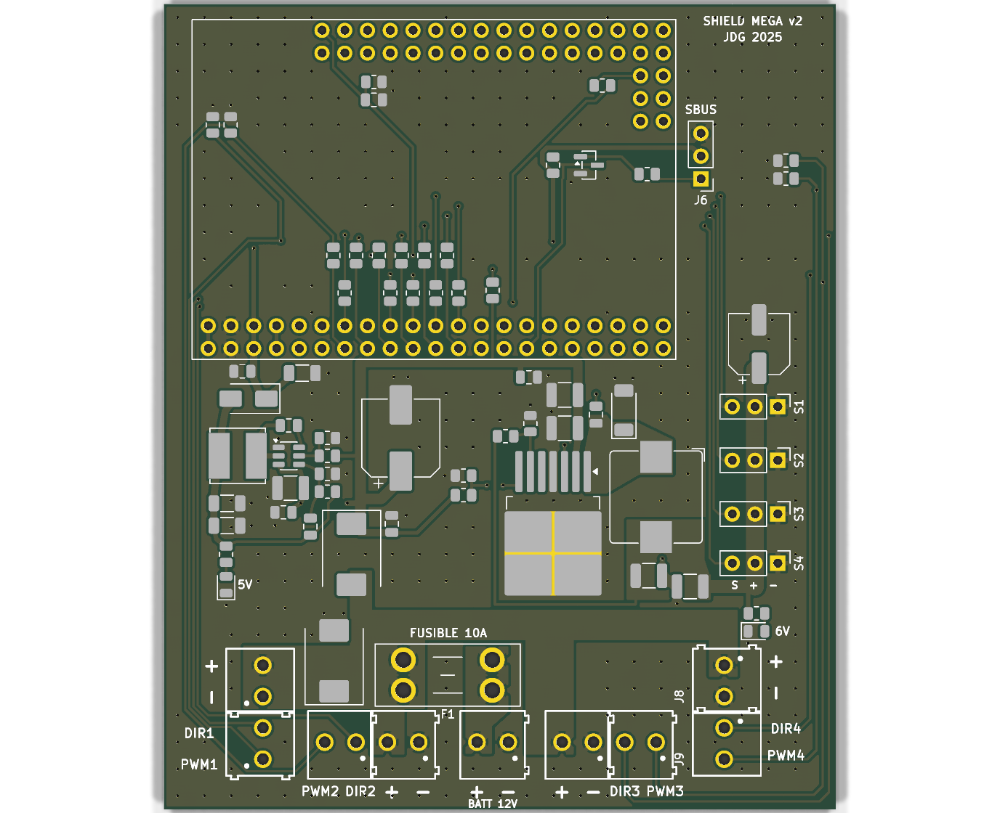
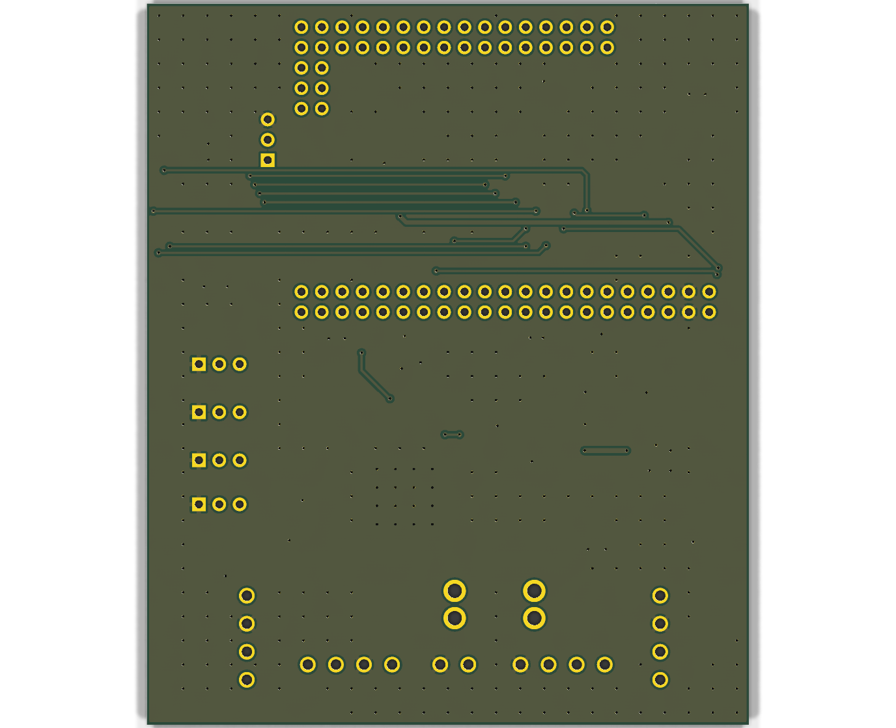

# Machine JDG 2025 – Shield Mega 2560 PRO v2 (CMS, 2 couches)

Version améliorée de `Shield Arduino Mega 2025/MachineJDG2025_MEGA2560_Shield_VL_2024_12_19`.
Le contour (75 × 90 mm), les connecteurs, leurs positions et le brochage sont identiques.
La carte remplace l'ancienne sans toucher au câblage ni au code.

| Dessus | Dessous (plan de masse) |
|---|---|
|  |  |

Projet KiCad 9 : ouvrir `MachineJDG2025_MEGA2560_Shield_v2.kicad_pro`. Les bibliothèques
`JDG2025.kicad_sym` et `JDG2025.pretty` sont dans le dossier : aucune configuration à faire.

## Ce qui change par rapport au shield 2025

| | 2025 | v2 |
|---|---|---|
| Couches | 1 (tout sur le dessus) | 2 : plan de masse plein en dessous, remplissage GND au-dessus, 277 vias de couture |
| Composants | traversants | CMS, sauf connecteurs, porte-fusible et module |
| 6 V servos | module LM2596 enfiché | régulateur LM22678 intégré (5 A, ~5,95 V) |
| 5 V logique | régulateur du module Mega via VIN (12 V) | régulateur TPS54202 dédié (2 A) sur la broche 5V du module |
| Protection | aucune | fusible mini-lame 10 A remplaçable, TVS 15 V, diode anti-inversion sur les régulateurs |
| Sorties moteurs/servos | directes | résistance série 100 Ω sur chaque signal |
| Mesure batterie | non | A0 = V12 / 4 |
| Inverseur SBUS | 2N2222A traversant | MMBT3904 (SOT-23), même montage |
| Témoins | – | LED 6 V et LED 5 V |
| Cavaliers 0 Ω | R3–R6 | supprimés (2 couches) |

Chaîne d'alimentation : `J1 (batterie)` → `F1 10 A` → `VBAT`. `VBAT` alimente les 4 borniers
moteurs (J2, J10, J4, J8) et la TVS D1. `D2` fournit `V12` aux deux régulateurs : 6 V pour les
servos, 5 V pour le module et le SBUS.

## À savoir avant de brancher

- **VIN du module n'est plus utilisé.** Le module est alimenté par sa broche 5V, via le TPS54202 et D4.
- **USB** : D4 empêche le 5V de l'USB de remonter dans le régulateur. On peut programmer
  avec ou sans la batterie. Sans batterie, les servos et les moteurs ne sont pas alimentés.
- **Batterie** : 12 V ou LiPo 3S (12,6 V chargée). **15 V maximum** : au-delà, la TVS D1 conduit.
  Une 4S (16,8 V) est interdite.
- **Batterie inversée** : D1 conduit et le fusible F1 fond. Remplacer le fusible après avoir corrigé le branchement.
- **Mesure batterie** : `float vbat = analogRead(A0) * 5.0 / 1023 * 4 + 0.4;`
  (0,4 V ≈ chute de D2 ; à étalonner avec un multimètre si besoin).
- **Pull-down PWM (R30–R33)** : pastilles prévues mais non posées (DNP). Si un moteur bouge
  au démarrage ou pendant la programmation du Mega, souder des 4,7 kΩ 0805.
- **Module** : même empreinte que le shield 2025. Le Mega 2560 PRO Embed se monte sur des
  embases femelles, comme avant.
- **Servos S1–S4 et SBUS J6** : empreinte standard au pas de 2,54 mm. La BOM prévoit des
  barrettes mâles ; les barrettes femelles SSW-103 du shield 2025 se soudent aussi sur ces pastilles.

## Fabrication (JLCPCB)

Tout est dans `fabrication/` :

| Fichier | Usage |
|---|---|
| `MachineJDG2025_MEGA2560_Shield_v2_gerbers_JLCPCB.zip` | Gerbers + perçages à téléverser tels quels |
| `BOM_JLCPCB.csv`, `CPL_JLCPCB.csv` | Assemblage CMS (55 composants, dessus seulement) |
| `BOM_complet.csv` | Liste complète, avec les pièces traversantes à souder à la main |
| `*_schema.pdf`, `*_dessus.pdf` | Schéma et plan d'implantation à imprimer |

Options de commande : 2 couches, 1,6 mm, pistes et isolations ≥ 0,2 mm, vias 0,3/0,6 mm (standard).
Cuivre 1 oz. Choisir 2 oz pour plus de marge si les 4 moteurs tirent ensemble près de 10 A.

À souder à la main : borniers J1–J5 et J8–J11, porte-fusible F1, barrettes S1–S4 et J6,
embases femelles du module.

## Vérifications faites

- ERC du schéma : 0 erreur, 0 avertissement.
- DRC du PCB : 0 erreur d'isolation, 0 connexion manquante.
- Parité schéma ↔ PCB : identiques, à 6 avertissements près. Ce sont les broches ICSP
  (MISO, MOSI, SCK, RESET, 5V_3, GND_3) du symbole du module, qui n'ont pas de pastille dans son empreinte.
- Restes volontaires, identiques au shield 2025 :
  - 4 recouvrements de courtyard entre borniers accolés (J2/J3, J4/J5, J8/J9, J10/J11) ;
  - recouvrements de sérigraphie entre ces mêmes borniers.

## Points à vérifier avant de commander

- **Valeurs des régulateurs** : le diviseur FB, les inductances et les condensateurs de
  LM22678 et TPS54202 viennent du projet `MachineJDG2027_Shield_v2`. Les datasheets TI
  n'étaient pas accessibles pendant la conception : les relire avant de commander.
- **Codes LCSC** : plusieurs pièces n'ont pas de code (C1, C3/C4/C10, C6, C7/C8, C9, C13,
  C14/C15, C16, D1, D2, D3, L1, L2, LED1/2, R4/R9, R5, R11, R13). Les compléter dans JLC et
  vérifier le stock et le boîtier.
- **Rotations CPL** : vérifier l'orientation dans l'aperçu d'assemblage JLC, surtout pour
  les SOT-23, TO-263, diodes et électrolytiques.
- **Dessous** : le plan de masse n'est coupé que par une bande de signaux sous le module (y ≈ 64–78 mm),
  là où les commandes moteurs et servos se croisent.

## Régénérer

La carte est produite par les scripts de `../outils/` : schéma, placement, routage
manuel des alimentations, Freerouting pour les signaux, puis zones et vias de couture.
Voir `../outils/LISEZMOI.md`.
